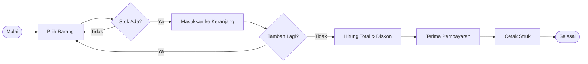
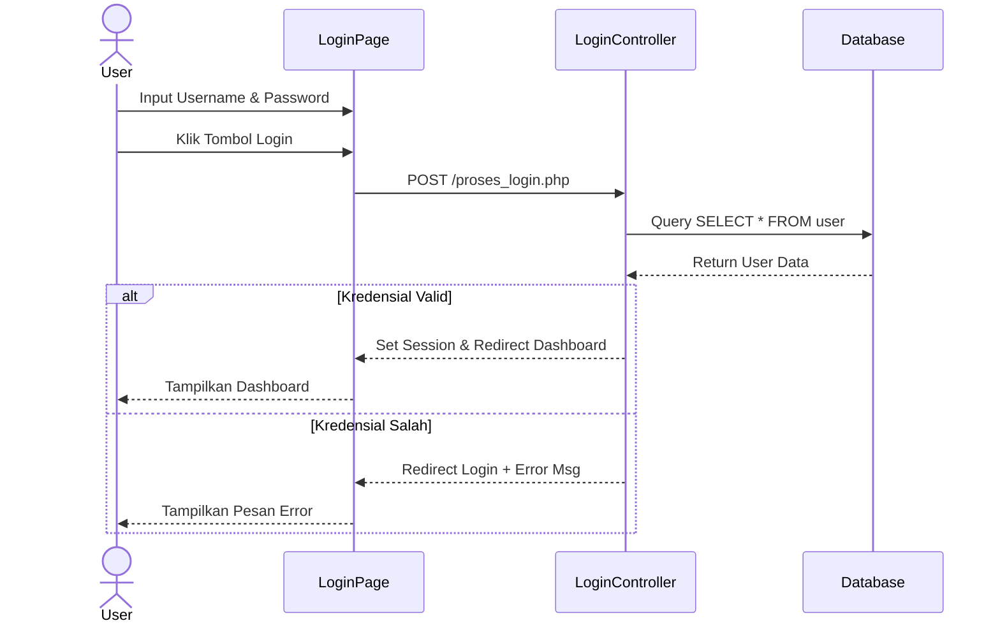
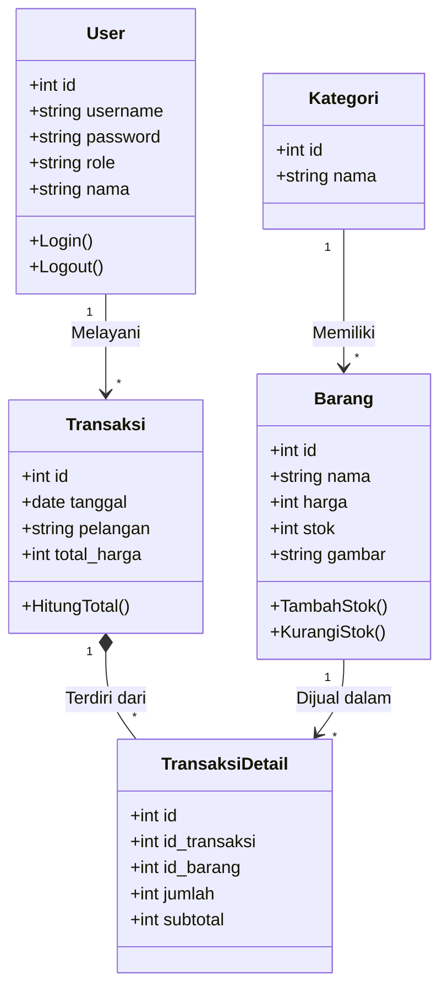

# 🛒 Sistem Kasir & Inventori (Toko Berkah Jaya)

> **Tugas Besar Analisis dan Desain Berorientasi Objek (ADBO)**
>
> **Program Studi:** Teknik Informatika
> **Fakultas:** Ilmu Komputer
> **Universitas:** [Nama Universitas Anda]

---

## 👥 Anggota Kelompok

| NIM | Nama Mahasiswa | Peran / Kontribusi |
| :--- | :--- | :--- |
| **[Masukkan NIM 1]** | **[Nama Mahasiswa 1]** | *System Analyst & Diagram Designer* (Analisis Sistem, UML, Database) |
| **[Masukkan NIM 2]** | **[Nama Mahasiswa 2]** | *Frontend / UI Designer* (Desain Antarmuka, CSS, Bootstrap) |
| **[Masukkan NIM 3]** | **[Nama Mahasiswa 3]** | *Documentation & Reporting* (Penyusunan Laporan, User Manual) |

---

## 📖 Deskripsi Proyek

**Sistem Kasir & Inventori Toko Berkah Jaya** adalah aplikasi berbasis web yang dibangun untuk memodernisasi proses bisnis UMKM ritel. Sistem ini menggantikan pencatatan manual dengan solusi digital yang terintegrasi, mencakup **Point of Sales (POS)**, **Manajemen Stok**, dan **Pelaporan Keuangan**.

Sistem dirancang menggunakan pendekatan **Object-Oriented** untuk memastikan kode yang modular, mudah dipelihara (maintainable), dan dapat dikembangkan lebih lanjut (scalable).

### 🎯 Tujuan Pengembangan
1.  **Efisiensi Operasional**: Mempercepat proses checkout kasir hingga 50%.
2.  **Akurasi Data**: Menghilangkan kesalahan manusia (human error) dalam penghitungan stok dan total belanja.
3.  **Transparansi**: Pemilik toko dapat memantau omset dan stok menipis secara realtime dari dashboard.

---

## 🧩 Artefak Desain (UML)

Berikut adalah model desain sistem yang dibuat berdasarkan standar UML (Unified Modeling Language):

### 1. Use Case Diagram
Menggambarkan interaksi antara aktor (Admin, Kasir) dengan fungsionalitas sistem.

```mermaid
usecaseDiagram
    actor "Admin" as A
    actor "Kasir" as K

    package "Sistem Toko Berkah Jaya" {
        usecase "Login" as UC1
        usecase "Kelola Produk (CRUD)" as UC2
        usecase "Kelola Kategori" as UC3
        usecase "Kelola Akun Kasir" as UC4
        usecase "Transaksi Penjualan" as UC5
        usecase "Lihat Laporan" as UC6
        usecase "Logout" as UC7
    }

    A --> UC1
    A --> UC2
    A --> UC3
    A --> UC4
    A --> UC6
    A --> UC7

    K --> UC1
    K --> UC5
    K --> UC6
    K --> UC7
```

### 2. Skenario Use Case
Dokumentasi alur detail untuk Use Case utama.

| ID | Nama Use Case | Aktor | Kondisi Awal | Langkah Utama | Kondisi Akhir |
| :--- | :--- | :--- | :--- | :--- | :--- |
| **UC-01** | **Login** | Admin/Kasir | User di halaman Login | 1. Input Username & Password<br>2. Klik Login<br>3. Sistem validasi kredensial | User masuk ke Dashboard sesuai Role |
| **UC-02** | **Transaksi** | Kasir | User di halaman Transaksi | 1. Pilih Produk<br>2. Input Jumlah<br>3. Tambah ke Keranjang<br>4. Bayar & Cetak Struk | Stok berkurang, data tersimpan di Laporan |
| **UC-03** | **Kelola Produk** | Admin | User di halaman Produk | 1. Klik Tambah Produk<br>2. Isi Form (Nama, Harga, Stok)<br>3. Upload Gambar<br>4. Simpan | Data produk baru tersimpan di database |

### 3. Activity Diagram (Alur Transaksi)
Memodelkan workflow proses penjualan barang oleh Kasir.



### 4. Sequence Diagram (Proses Login)
Menjelaskan interaksi objek saat proses autentikasi berlangsung.



### 5. Class Diagram
Struktur database dan relasi antar entitas dalam sistem.



### 6. Deployment Diagram
Arsitektur fisik sistem saat dijalankan.

```mermaid
graph TD
    Client[PC Kasir / Admin] -- HTTP/HTTPS --> WebServer[Web Server (Apache/Nginx)]
    WebServer -- PHP Process --> App[Aplikasi PHP_BARANG]
    App -- SQL Query --> DB[(Database MySQL)]
```

---

## 🚀 Fitur Lengkap

### 👨‍💼 Panel Admin (Administrator)
*   **Dashboard Utama**: Ringkasan total produk, kategori, transaksi hari ini, dan grafik pendapatan bulanan.
*   **Manajemen Produk**: Tambah produk baru, edit harga/stok, hapus produk, upload gambar produk.
*   **Indikator Stok**: Notifikasi visual (badge merah/kuning) untuk stok habis atau menipis.
*   **Manajemen Kategori**: Menambah dan mengedit kategori barang agar lebih terorganisir.
*   **Manajemen User**: Menambah akun untuk kasir baru.
*   **Laporan Transaksi**: Melihat riwayat penjualan dengan filter tanggal (Harian/Bulanan/Tahunan) dan fitur Cetak Laporan.

### 🏪 Panel Kasir (Point of Sales)
*   **Halaman Transaksi**: Desain intuitif untuk input pesanan cepat.
*   **Pencarian Cepat**: Cari barang berdasarkan nama.
*   **Keranjang Belanja**: Review item sebelum checkout.
*   **Kalkulasi Otomatis**: Menghitung subtotal, diskon (jika ada), dan total akhir otomatis.
*   **Cetak Struk**: Fitur print struk belanja untuk pelanggan.
*   **Riwayat Transaksi Harian**: Kasir dapat melihat rekap penjualan mereka sendiri hari ini.

---

## 💻 Tech Stack (Lingkungan Pengembangan)

*   **Backend**: PHP Native (Versi 8.0+)
*   **Database**: MySQL / MariaDB
*   **Frontend**: HTML5, CSS3, Bootstrap 5 Framework
*   **Icons**: Bootstrap Icons
*   **Charting**: Chart.js (Untuk grafik dashboard)
*   **Server Local**: XAMPP / Laragon

---

## ⚙️ Panduan Instalasi

1.  **Clone / Download** repository ini.
2.  **Database Setup**:
    *   Buka phpMyAdmin.
    *   Buat database baru bernama `php_barang`.
    *   Import file `php_barang.sql` (tersedia di folder root project).
3.  **Konfigurasi**:
    *   Buka file `conn/koneksi.php`.
    *   Pastikan konfigurasi host, user, dan password database sesuai.
4.  **Jalankan**:
    *   Akses `http://localhost/PHP_BARANG` melalui browser.

---

## 🔐 Akun Default

| Role | Username | Password |
| :--- | :--- | :--- |
| **Admin** | `admin` | `admin` |
| **Kasir** | `kasir` | `kasir` |

---

**© 2026 Developed for Tugas Besar ADBO.**
